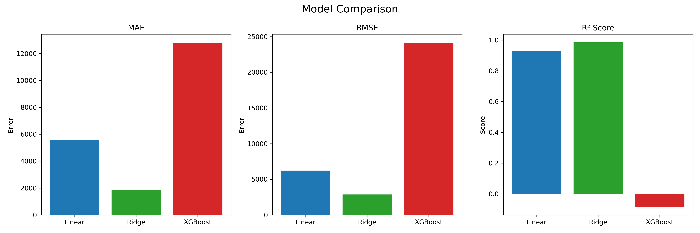
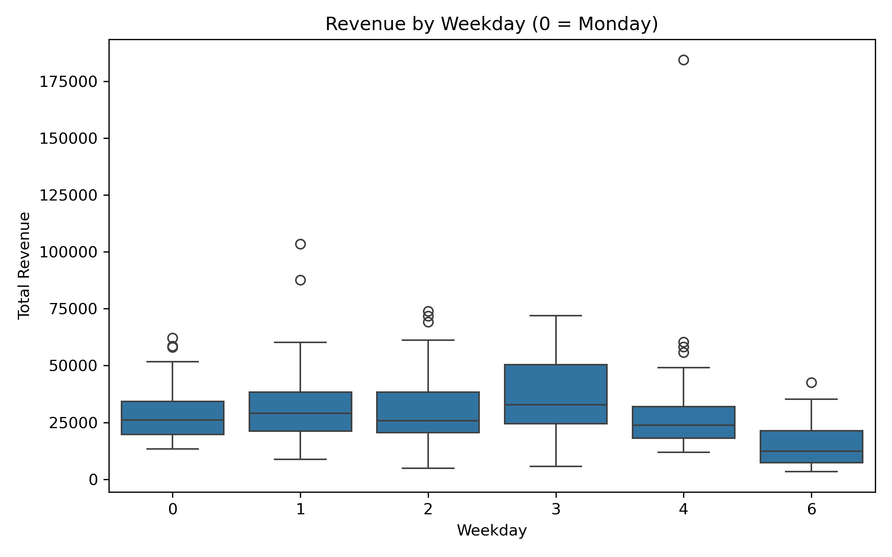
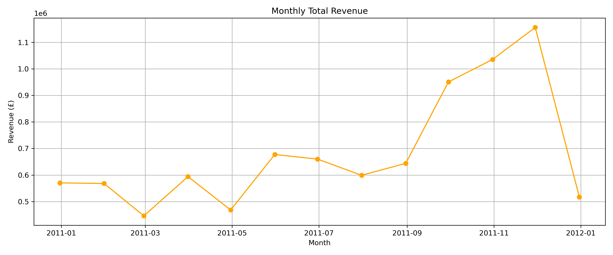
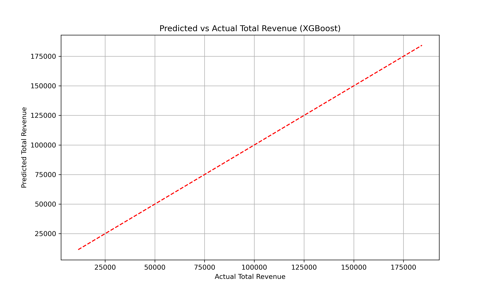
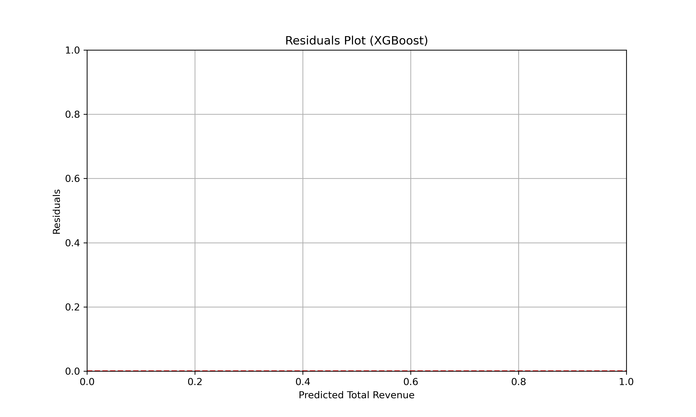
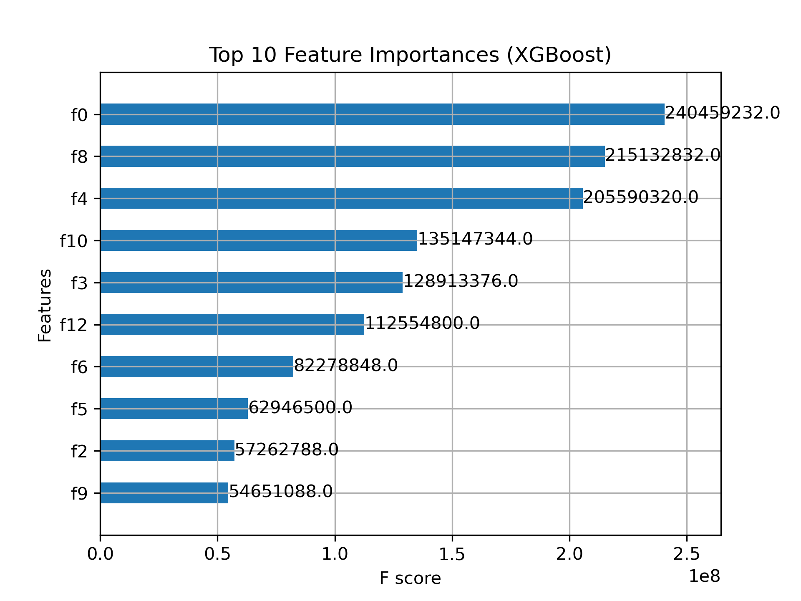

# 🛍️ Online Retail Sales Forecasting

[](https://www.python.org/)
[](./LICENSE)
[](https://github.com/Eugene90-design/online-retail-sales-forecasting/stargazers)

This project applies Exploratory Data Analysis and Regression Modeling on the **UCI Online Retail Dataset** to forecast daily total revenue using:

- 📈 Linear Regression  
- 🧠 Ridge Regression  
- 🌳 XGBoost Regression (with log-transformed targets for skewed distributions)

---

## 🗂️ Project Structure

```
Online-Retail-Sales-Forecasting/
│
├── Online_Retail_Sales_Forecasting.ipynb  # Main Jupyter notebook
├── README.md                              # Project summary and insights
├── LICENSE                                # License file (MIT)
├── requirements.txt                       # Dependencies
└── images/                                # Visualizations (plots)
```

---

## 🔍 Goal

To predict **daily total revenue** using time-based and calendar features extracted from the transaction data.

---

## 📊 Dataset

- **Source**: [UCI Machine Learning Repository](https://archive.ics.uci.edu/ml/datasets/Online+Retail)
- **Features**:  
  - Quantity  
  - UnitPrice  
  - InvoiceDate (converted to day/month/year/day of week)  
- **Target**:  
  - TotalRevenue = Quantity × UnitPrice

---

## 🧪 Models & Evaluation

After applying log transformation on the target to handle skewed revenue data:

| Model             | MAE        | RMSE       | R²       |
|------------------|------------|------------|----------|
| Linear Regression| 5555.98    | 6231.09    | 0.9278   |
| Ridge Regression | 1881.92    | 2881.33    | 0.9846   |
| XGBoost          | 12798.51   | 24139.30   | -0.0836  |

---

## 📈 Visualizations

### 📊 Model Comparison (MAE, RMSE, R²)


### 📅 Revenue by Day of the Week


### 📈 Monthly Revenue Trend


### 🤖 Model Predictions vs Actuals


### 🧾 Residual Plot


### 📊 Feature Importance (XGBoost)


---

## 💡 Key Insights

- Log-transforming the target improved prediction performance, especially for large sales spikes.
- XGBoost underperformed likely due to overfitting, limited regularization, or sensitivity to the log-transformed target.
- Ridge Regression provided the best overall performance by balancing bias and variance, benefiting from engineered time-based features.

---

## 🚀 How to Reproduce

1. Clone this repo:
   ```bash
   git clone https://github.com/Eugene90-design/online-retail-sales-forecasting.git
   cd online-retail-sales-forecasting
   ```

2. Install dependencies:
   ```bash
   pip install -r requirements.txt
   ```

3. Run the Jupyter notebook:
   ```bash
   jupyter notebook
   ```

---

## 🧠 Author

**Eugene Acquah**  
Master in AI & Data Science – Panamerican University  
GitHub: [@Eugene90-design](https://github.com/Eugene90-design)

---

## 📬 Feedback & Contributions

Open to improvements, suggestions, and PRs.  
Feel free to fork and build on this work!
